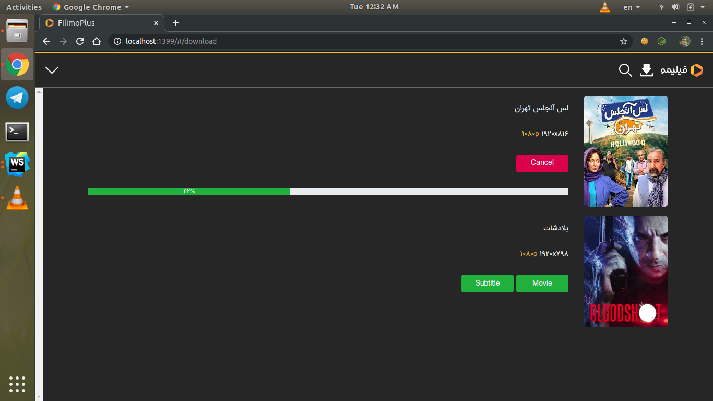

# FilimoPlus

### About

With this app you can browse filimo, search and **download** items!

### Note

You must create account in [filimo](https://www.filimo.com/) and buy subscription package to use this app

### Dependencies

+ [Node.js](https://nodejs.org/en/)
+ [FFmpeg](https://www.ffmpeg.org/)

### Setup

+ Download latest version from releases section
+ Cd to project directory
+ Run: `npm install`
+ Run: `npm run filimo-plus`
+ Open `http://localhost:1399` in your browser

### Thanks

To [@NabiKAZ](https://github.com/NabiKAZ) for [filimo-downloader](https://github.com/NabiKAZ/filimo-downloader)

### Support

I spent huge amount of time for creating FilimoPlus 
If you like my work please show your support by clicking on star button and share this repo with your friends 
Thank you!
